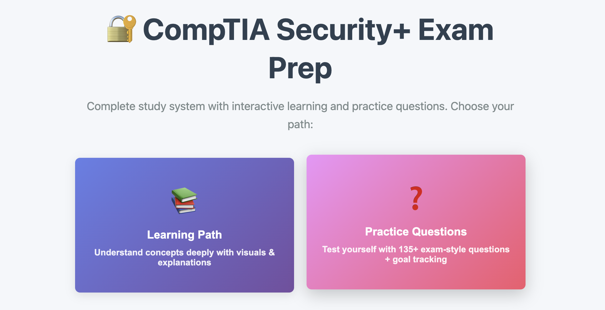
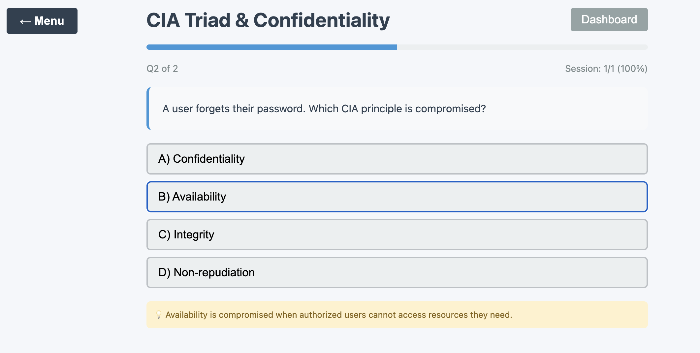
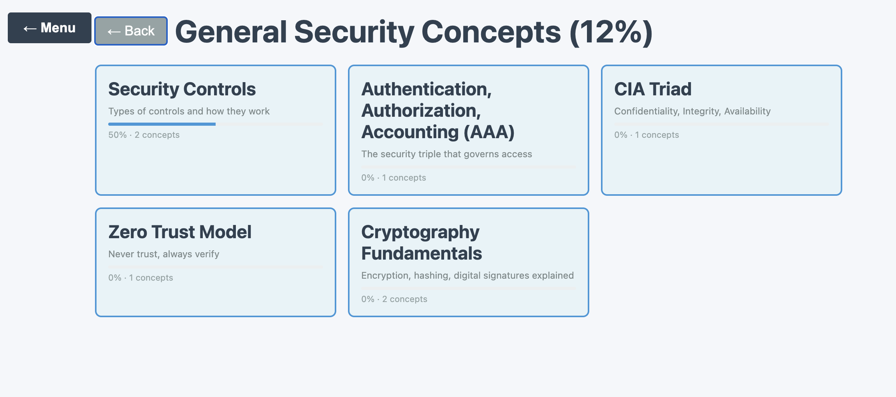

# 🔐 CompTIA Security+ Exam Prep

**Interactive study system for the CompTIA Security+ (SY0-701) certification.** A structured learning path, 135+ practice questions, and progress tracking — everything needed to prepare in one place.

🔗 **Live app:** [comptiasecuritycertification.vercel.app](https://comptiasecuritycertification.vercel.app/)



---

## ✨ What it does

Preparing for a certification exam usually means juggling scattered notes, question dumps, and no sense of progress. This app puts the whole preparation flow in one interface:

1. **Follow a structured learning path** — topics organized to build on each other, mirroring the official exam domains
2. **Practice with 135+ questions** — instant feedback with explanations, not just right/wrong
3. **Track your progress** — see which domains are solid and which need another pass before exam day

## 🎯 Why I built it

Studying for Security+ myself, I wanted a tool that treats exam prep as a *learning journey* with visible progress — not a random question grinder. Building it doubled as both study method and portfolio project: explaining a concept well enough to write a question about it is the best way to learn it.

## 🛠️ Tech stack

| Layer | Technology |
|---|---|
| Frontend | React 18, Vite, Tailwind CSS |
| State & progress | Client-side state management |
| Deployment | Vercel |

## 🧠 Design highlights

- **Learning path over question dump:** content is sequenced by exam domain, so the app guides *what to study next* instead of leaving the user to decide.
- **Feedback that teaches:** every practice question explains the reasoning behind the correct answer — the difference between memorizing and understanding.
- **Progress as motivation:** visible completion tracking turns an intimidating certification into a series of small wins.
- **Zero-friction access:** no login, no setup — open the link and start studying immediately.

## 📸 Screenshots

| Learning path | Practice questions | Progress tracking |
|---|---|---|
|  |  |  |

## 🚀 Run locally

```bash
git clone https://github.com/ElinaG3/YOUR-REPO-NAME.git
cd YOUR-REPO-NAME
npm install
npm run dev
```

## 🗺️ Roadmap

- [ ] Expanded question bank (200+ questions)
- [ ] Exam simulation mode (timed, scored like the real test)
- [ ] Spaced-repetition review of missed questions
- [ ] Multilingual support (EN / DE)

## 📄 License

MIT

---

*Built by [Elina](https://github.com/ElinaG3) — part of a portfolio focused on tools that teach complex material through structured, interactive practice.*
<<<<<<< Updated upstream
---
=======
>>>>>>> Stashed changes
